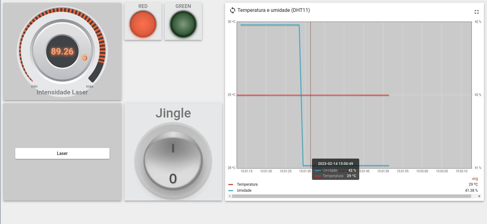

# Trabalho Final - Fundamentos de Sistemas Embarcados

Este trabalho visa a criação de sensores e atuadores distribuídos baseados nos microcontroladores ESP32 conectados via Wifi através do protocolo MQTT.
Os microcontroladores ESP32 controlam a aquisição de dados dos botões e chaves além de acionar saídas de led e outros três dispositivos.

Mais especificações em: [Trabalho Final 2022.2.](https://gitlab.com/fse_fga/trabalhos-2022_2/trabalho-final-2022-2)

## Integrantes

Nome | Matrícula
-----| --------
Ailamar Alves | 16/0022673
Guilherme Braz | 18/0018159
Matheus Amaral | 17/0080307

## Funcionalidades do sistema

Os componentes do sistema permitem:

- Leitura e envio dos valores de temperatura e umidade pelo sensor DHT11;
- Acionamento do LED RGB (Saída) à partir dos comandos RPC enviados pelo Dashboard de maneira dimerizável;
- Acionamento de botão Chave KY-004 que alterna a cor do LED quando acionado;
- Acionamento de um buzzer KY-012 por meio da dashboard com a transmissão de uma música;
- Acionamento de um laser KY-008 e controle de sua intensidade pela técnica de PWM.

## Dashboard

 

## Vídeo 

[Acesse o vídeo de demonstrção do projeto.](https://youtu.be/jpVEPtObJEc "Trabalho Final")

## Instruções de uso

1. Clonar o repositório:

```
$ git clone https://github.com/FSE-2022-2/trab3-final.git
```

2. Para atualizar os dados de conexão wifi acesse o menu de configuração:
```
$ pio run -t menucofig
```

3. . O menu de configuração do projeto é: 
```
$ ** Project Configuration --->
```

4. Para realizar a build e upload do código na esp32, foi utilizada a extensão [Platform.IO](https://platformio.org/) no VsCode. Com os seguintes detalhes de configuração:
 
- platform = espressif32
- board = esp32doit-devkit-v1
- framework = espidf

5. Para realizar a build e upload do código do buzzer, contido na pasta [buzzer_sketch](https://github.com/FSE-2022-2/trab3-final/tree/main/buzzer_skecth), foi utilizado o [Arduino IDE](https://www.arduino.cc/en/software) com as seguintes configurações:

- board = ESP32-WROOM-DA Module

> Note que o código do buzzer é necessário ser rodado em outra esp32 em paralelo com o código original do projeto em outra placa. Em que a saída d5 da esp32 do buzzer é conectada ao pino d12 da esp32 do projeto para ele ser acionado.

6. O dashboard com a leitura dos dispositivos pode ser visualizado em [Ailamar-Guilherme-Matheus.](http://164.41.98.25:443/dashboards/43358ba0-aa58-11ed-8436-09bf763c9306)


